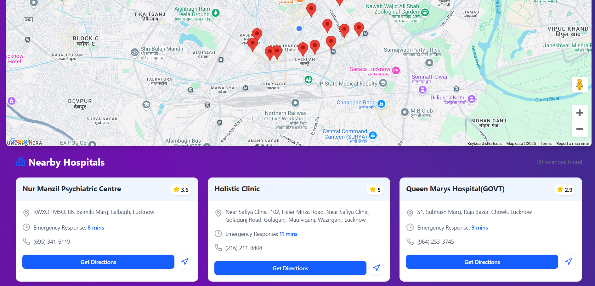

# Hospitals Navigator

## Screenshots 


---

## Tech Stack
React, Tailwind CSS
Firebase Authentication
Google Maps API

---

## Installation
### Clone the Repository
```sh
git clone https://github.com/Prakhar9450/HospitalsNavigator.git
cd HospitalsNavigator
```

### Install Dependencies
```sh
npm install
```

### Set Up Firebase
Create a `.env` file in the root directory and add your Firebase credentials:
```sh
VITE_API_KEY=your_api_key
VITE_AUTH_DOMAIN=your_auth_domain
VITE_PROJECT_ID=your_project_id
VITE_STORAGE_BUCKET=your_storage_bucket
VITE_MESSAGING_SENDER_ID=your_messaging_sender_id
VITE_APP_ID=your_app_id
```

### Run the Project
```sh
npm run dev
```


## 🚀 Features
- 🔍 **Find Nearby Hospitals** – Displays hospitals based on user location.
- 🗺️ **Interactive Map** – Google Maps integration to visualize hospital locations.
- 🔐 **Google Authentication** – Secure sign-in with Google.
- 📜 **Hospital Listings** – View details of nearby hospitals in a structured list.


---

## 🔗 Deployment Link
https://hospitals-navigator.vercel.app/